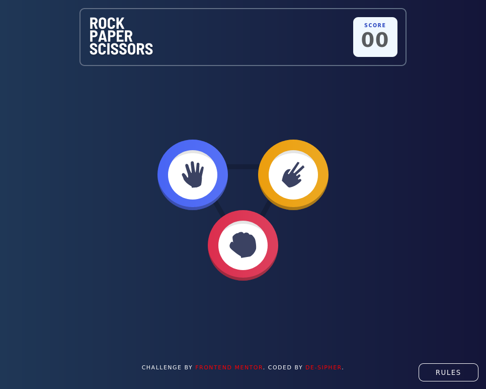
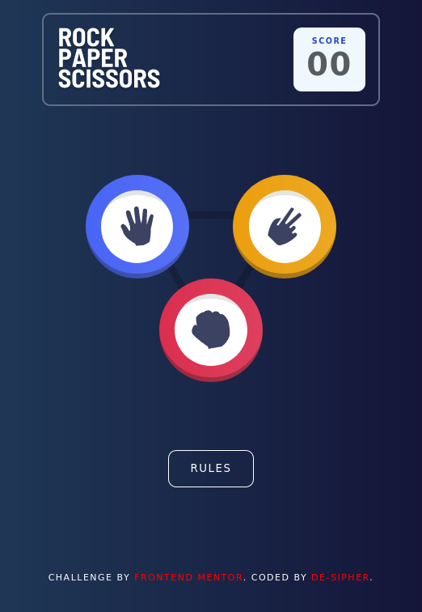

# Frontend Mentor - Rock, Paper, Scissors solution

This is a solution to the [Rock, Paper, Scissors challenge on Frontend Mentor](https://www.frontendmentor.io/challenges/rock-paper-scissors-game-pTgwgvgH). Frontend Mentor challenges help you improve your coding skills by building realistic projects. 

## Table of contents

- [Frontend Mentor - Rock, Paper, Scissors solution](#frontend-mentor---rock-paper-scissors-solution)
  - [Table of contents](#table-of-contents)
  - [Overview](#overview)
    - [The challenge](#the-challenge)
    - [Screenshot](#screenshot)
    - [Links](#links)
  - [My process](#my-process)
    - [Built with](#built-with)
    - [What I learned](#what-i-learned)
    - [Continued development](#continued-development)
    - [Useful resources](#useful-resources)
  - [Author](#author)
  - [Acknowledgments](#acknowledgments)

## Overview

### The challenge

Users should be able to:

- View the optimal layout for the game depending on their device's screen size
- Play Rock, Paper, Scissors against the computer
- Maintain the state of the score after refreshing the browser _(optional)_

### Screenshot

### Links

- Solution URL: [Frontend Mentor](https://www.frontendmentor.io/solutions/rockpaperscissors-with-a-few-animations-BkgsMwbNc#comment-6253e68ff223eb5a9910d02d)
- Live Site URL: [Netlify](https://fluffy-meerkat-cf44db.netlify.app/)

## My process

- Set up HTML semantic tags with BEM
- Design for mobile first
- Make things functional with JS
- Make things pretty with CSS
- Finalize and polish everything by debugging everything.

### Built with

- Semantic HTML5 markup
- CSS custom properties
- Flex box
- CSS Grid
- Vanilla JS
- Sass

### What I learned

Managing different states of a webpage is quite difficult and I need to find a better and more efficient way to do so. Setting intersection observer was a little bit of a breakthrough for me since I no longer need to be checking for an element's display property with a loop. 

### Continued development

Animating shadows was quite tricky. It was also not advised to put animation on shadows and instead use something like opacity on a pseudo element which unfortunately did not work in my case. My shadows were'nt visible on the my element, the reason for which I could not figure out.

### Useful resources

- [Css Shadows](https://css-tricks.com/almanac/properties/b/box-shadow/) - This helped me better understand and customize my shadows.

## Author

- Frontend Mentor - [@de-sipher](https://www.frontendmentor.io/profile/de-sipher)

## Acknowledgments

[Kewin Powell](https://www.youtube.com/user/KepowOb)